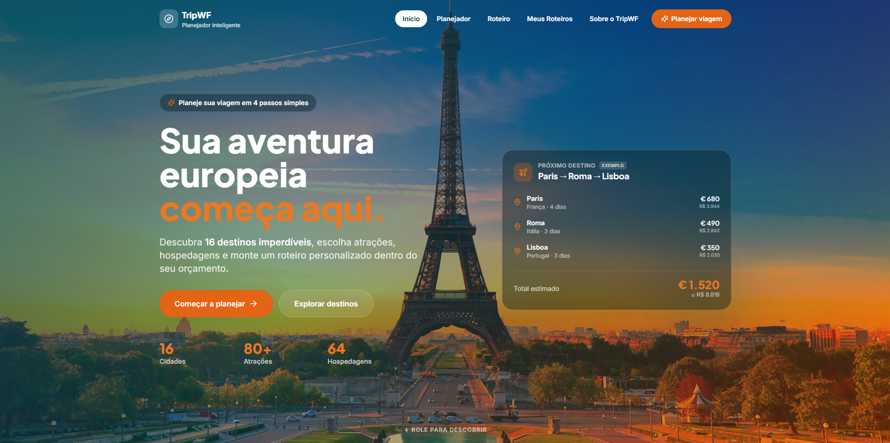
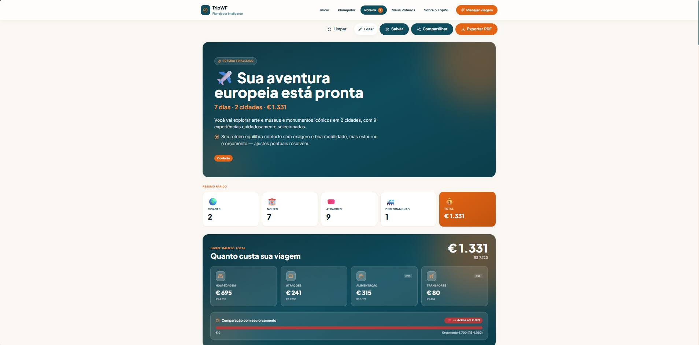
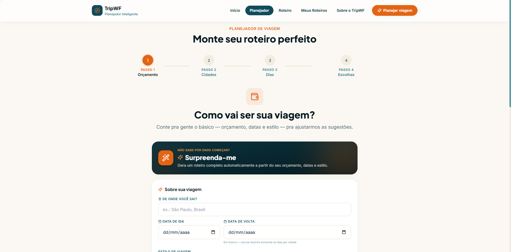
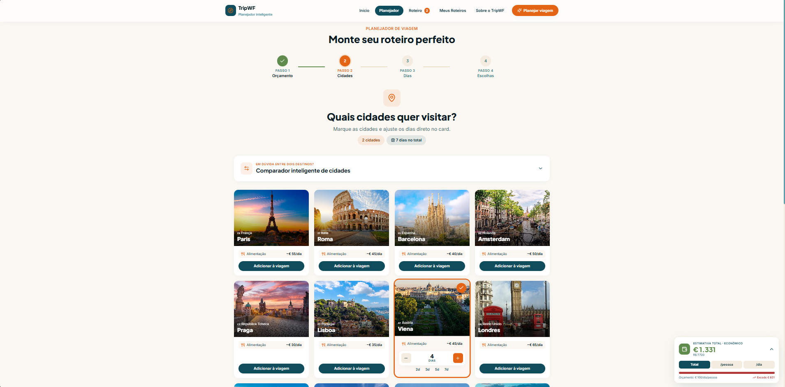

<div align="center">


# TripWF

### Plataforma de Planejamento de Viagens pela Europa

[](https://tripwf.vercel.app)
[](https://tripwf.vercel.app)
[](LICENSE)

**[▶ Acessar o site →](https://tripwf.vercel.app)**

</div>

---

## 📌 Sobre o Projeto

**TripWF** é uma plataforma web para planejar viagens pela Europa de forma inteligente e personalizada. O usuário explora **16 destinos europeus**, monta roteiros com atrações e hospedagens reais, compara cidades, calcula custos e exporta tudo em PDF — sem precisar criar conta.

Toda a experiência é guiada por um wizard de 4 etapas que considera orçamento, estilo de viagem, época do ano e número de viajantes para gerar sugestões personalizadas.

---

## ✨ Funcionalidades

- 🗺️ **Exploração de 16 destinos europeus** com fotos, descrições e ficha técnica por cidade
- 🧙 **Wizard de planejamento** em 4 etapas: orçamento → cidades → dias → atrações/hospedagem
- 🤖 **Sugestões automáticas** baseadas no estilo de viagem (cultural, gastronômico, noturno…)
- ⚖️ **Comparador de cidades** com 9 dimensões ponderadas (cultura, gastronomia, segurança, custo…)
- 🎲 **Modo Surpresa** — gera um roteiro completo automaticamente
- 📋 **Roteiro premium** com timeline, mapa interativo, transportes e estimativas de deslocamento
- 💰 **Cartão de economia** — compara o custo real vs. turista sem planejamento
- 📆 **Preços por temporada** — hotéis e voos com multiplicadores por alta/baixa temporada
- 📄 **Exportação em PDF** do roteiro completo (gerado no browser, sem servidor)
- 🔗 **Compartilhamento por link** — roteiro codificado em URL, sem login
- ✅ **Checklist adaptativo** de viagem, ajustado ao roteiro montado
- 💾 **Múltiplos roteiros salvos** localmente (sem conta, sem backend)
- 🌐 **Mapa interativo** com marcadores por cidade via Leaflet + OpenStreetMap

---

## 🛠️ Tecnologias

<div align="center">


</div>

| Camada | Tecnologia |
|---|---|
| Framework | React 18 + Vite 5 |
| Estilos | Tailwind CSS 3 + Framer Motion |
| Mapa | Leaflet + OpenStreetMap (sem chave de API) |
| Persistência | localStorage (sem backend, sem banco de dados) |
| PDF | jsPDF + html2canvas |
| Ícones | Lucide React |
| Roteamento | React Router DOM v6 |
| Deploy | Vercel |

---

## 📸 Screenshots


<br/><br/>

<br/><br/>

<br/><br/>


---

## 🚀 Rodando Localmente

### Pré-requisitos

- [Node.js](https://nodejs.org/) 18 ou superior
- npm (incluso no Node.js)

### Passo a passo

```bash
# 1. Clone o repositório
git clone https://github.com/leomoraessantdev/tripwf.git
cd tripwf

# 2. Instale as dependências
npm install

# 3. Inicie o servidor de desenvolvimento
npm run dev
```

Abra [http://localhost:5173](http://localhost:5173) no navegador.

### Scripts disponíveis

```bash
npm run dev      # Servidor de desenvolvimento com HMR
npm run build    # Build de produção (gera /dist)
npm run preview  # Preview do build localmente
```

### Variáveis de ambiente

**Nenhuma variável de ambiente é necessária.** O projeto usa:
- OpenStreetMap (gratuito, sem chave)
- Wikipedia REST API (gratuita, sem chave)
- localStorage para persistência de dados

---

## 📁 Estrutura do Projeto

```
tripwf/
├── public/
│   ├── favicon.svg
│   └── images/
│       ├── cities/        # 17 fotos de cidades
│       ├── attractions/   # 80 fotos de atrações
│       └── hotels/        # 67 fotos de hospedagens
└── src/
    ├── components/        # 38 componentes React
    │   ├── layout/        # Header, Footer
    │   ├── home/          # Hero, grid de destinos
    │   ├── cidade/        # Cards de atração e hospedagem
    │   ├── planejador/    # Wizard de planejamento
    │   ├── roteiro/       # Timeline, mapa, exportação
    │   └── ui/            # Botões, tags, toast, modal
    ├── context/           # ViagemContext (estado global)
    ├── data/              # 16 cidades, atrações, hotéis, scores
    ├── hooks/             # 6 hooks customizados
    ├── pages/             # 5 rotas (Inicial, Cidade, Planejador, Roteiro, Sobre)
    └── utils/             # 18 módulos utilitários (PDF, links, datas, cálculos…)
```

---

## 🌍 Destinos Disponíveis

Lisboa · Porto · Madrid · Barcelona · Paris · Amsterdam · Roma · Florença · Veneza · Praga · Viena · Budapeste · Berlim · Amsterdã · Dubrovnik · Santorini

---

## 📬 Contato

Desenvolvido por **Leonardo Moraes**

[](https://github.com/leomoraessantdev)

---

<div align="center">

Feito com ☕ e muito planejamento.

**[tripwf.vercel.app](https://tripwf.vercel.app)**

</div>
